# Installation

### 1. Download the repository

**Using git**
```sh
git clone https://github.com/Trsak/CoolFivemFramework
cd CoolFivemFramework
```

**Downloading Manually**

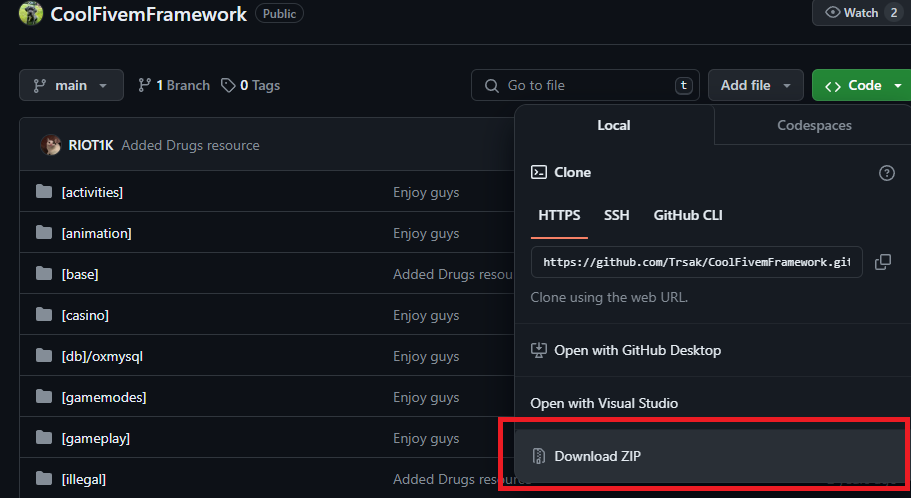

### 2. Import the SQL

**Using phpMyAdmin**

- Create a new database
- Select "SQL" tab
- Select the `database.sql` file provided

Make sure to **disable** "Enable foreign key checks"
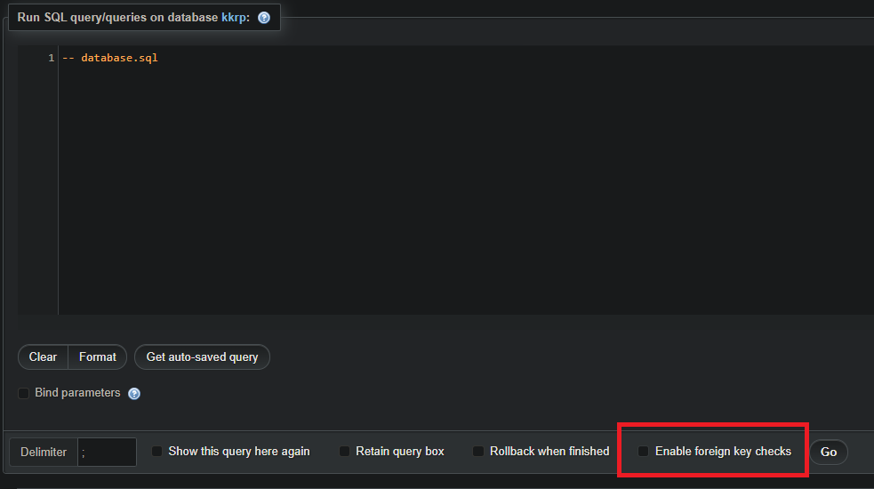

### 3. Setting up the server
**Using [txAdmin](https://github.com/tabarra/txAdmin/)**
* Create a new txAdmin profile
* Start the FXServer
* Go to http://localhost:30120 (or whatever port you use for txAdmin)
* Start the server setup

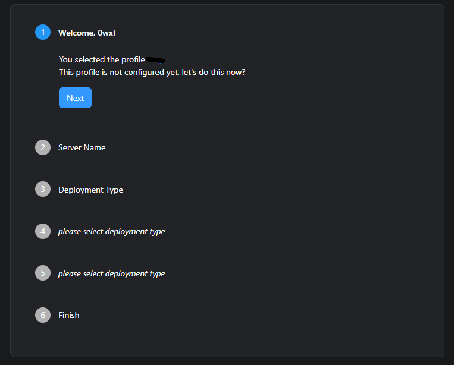

* Name your server

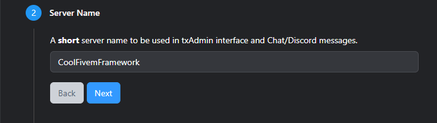

* As the deployment type, select "Existing Server Data"

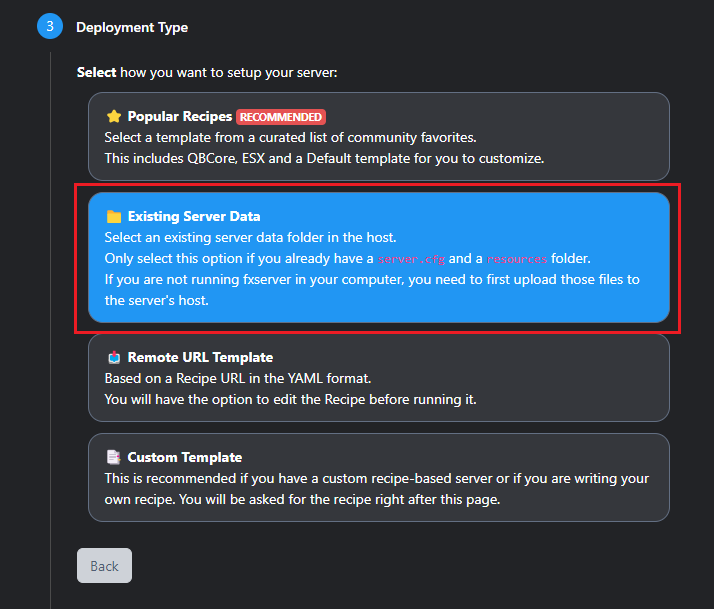

* Configure the "Base Folder" path (repo folder), the folder should look like this:
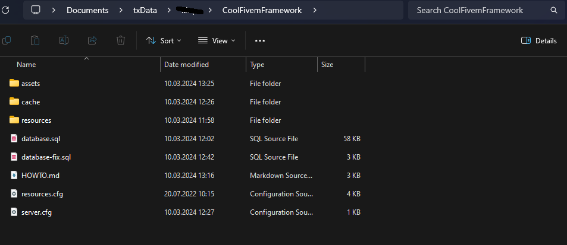

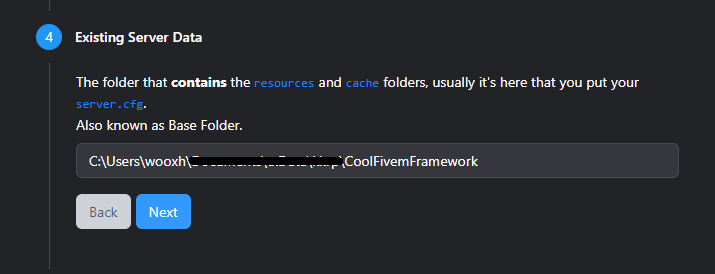

* Save everything and start the server

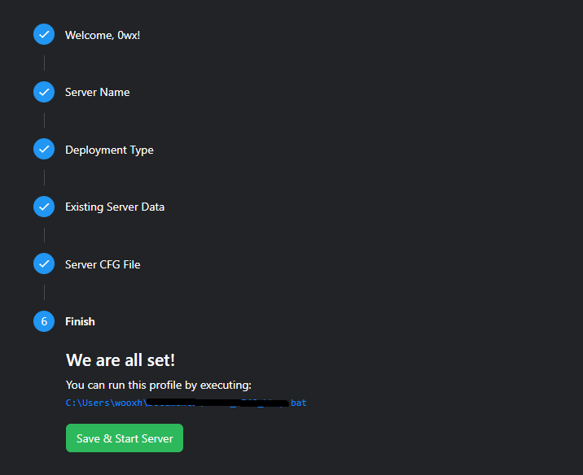

### 4. Starting the server
Upon starting your server, you will encounter some database errors, mostly with the `phone` resource. These errors look like this:

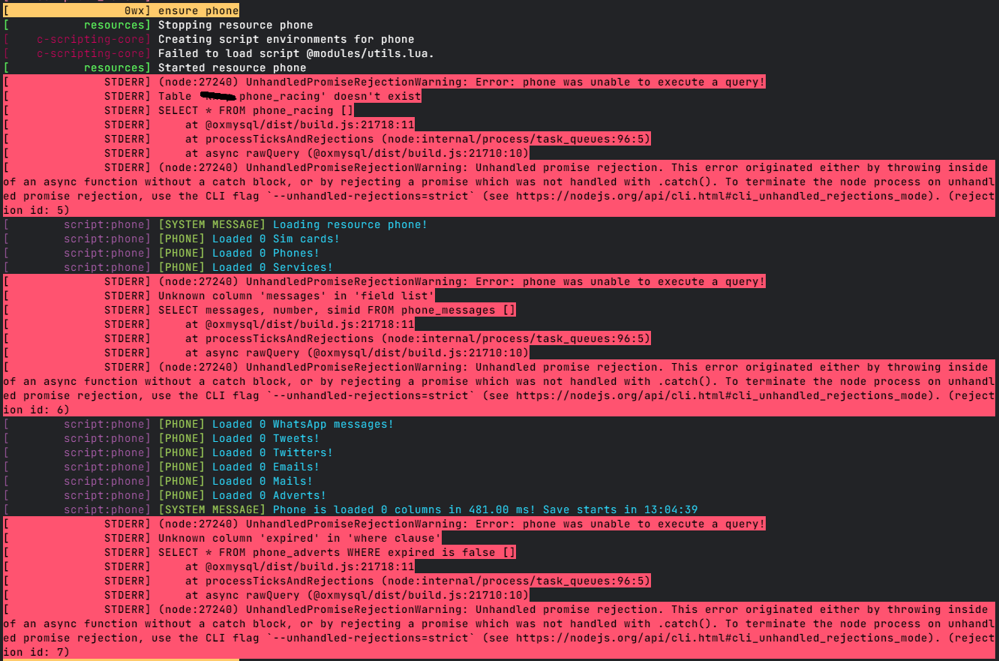

To fix them, import the `database-fix.sql` into your database and restart your server.
After restarting, you should see no errors, except those like

`"Couldn't find resource XXX"` - Most likely a paid resource, that couldn't be included in this framework

`"Couldn't not find XXX.lua"`

You can ignore these errors and join the server.

### 5. Final Touches

Upon trying to join, you will encounter this error

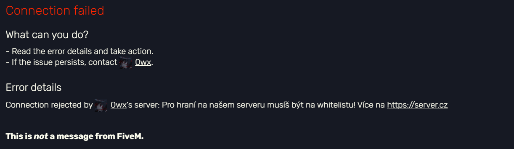

- Go to `resources/[base]/connect/server/main.lua`
- Comment lines `251 - 264`
- `ensure connect`

Before trying to join again, you will need to edit one more thing.

- Go to `resources/[base]/connect/server/main.lua`
- Replace lines `275 - 291` with the following snippet:
```lua
    local newUserAdded = exports.data:newConnectedUser(
        _source,
        {
            identifier = playerSteam,
            discord = playerDiscord,
            nickname = name,
            inAnim = false,
            source = _source,
            status = nil,
            admin = false, -- Set this to true if you want every new player to be admin
            settings = {},
            character = nil,
            chars_left = 2, -- Edit this number if you want more/less character slots for new players
            connectionTime = 0,
            whitelisted = true
        }
    )
```

**Updating fivem-appearance**
- Download [this version](https://github.com/pedr0fontoura/fivem-appearance/releases/download/v1.3.1/fivem-appearance.rar)
- Delete the old one in `resource/[ui]/fivem-appearance` and replace it with the one you just downloaded
- Restart the server

### Joining the server
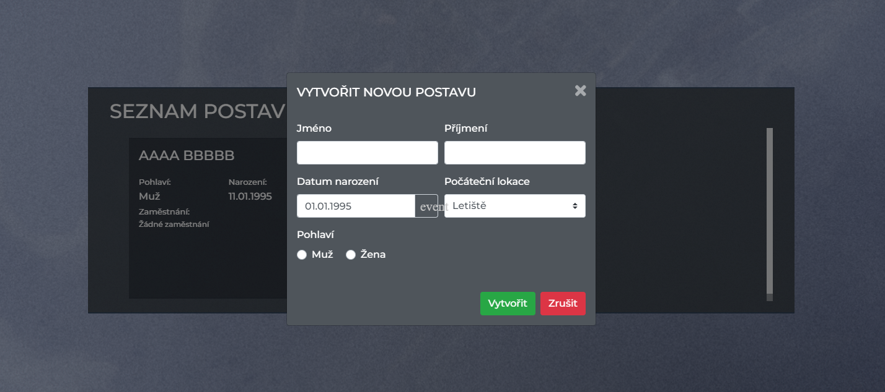
You can now join the server and create a character(s), but please keep in mind that a few resources will not work. As the original author(s) stated:

*There will be no future updates, the source code is given *as is*.*
